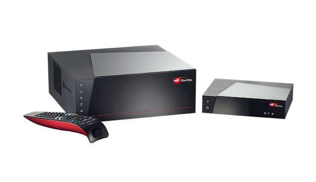

# HotRemote


HotRemote is a simple and user-friendly Go library for programmatically controlling HOT
Boxes.

<p align="center">
  
</p>

## Features

- **Hot Box Control:** Programmatically control your Hot Box, for example changing channels.
- **Button Press:** Simulate pressing buttons on your Hot Box's remote control, enabling you to automate
  tasks and create custom interactions.
- **API Abstraction:** Abstracts the complexity of Hot Box protocol, providing a simple and unified interface.
- **Feature Coverage:** Full capability with the mobile app.

## Installation

To use HotRemote in your Go project, you need to have Go installed and set up. You can install the library by running
the following command:

```bash
go get github.com/yakiroren/hotremote
```

## Usage

To use HotRemote in your Go code, import the library into your project:

```go
import "github.com/yakiroren/hotremote"
```

### Connecting to a Hot Box

```go
package main

import (
	"log"
	"github.com/yakiroren/hotremote"
)

func main() {
	client, err := HotRemote.New()
	if err != nil {
		log.Fatal(err)
	}

	// Use the `client` object to interact with the Hot Box
}
```

### List Connected Devices

```go
devices, err := client.ListDevices()
if err != nil {
    log.Fatal(err)
}

for _, device := range devices {
    log.Println(device.ID, device.Name)
}
```

```text
420254005266 HOT FiberBox266
316501071005 Hot FiberBox0000
321307003805 HOT mini FiberBox805
```

### Using Sessions

Use the device ID to create a session

```go
session := client.CreateSession("316501071005")

session.SwitchToChannel(13)

session.SwitchToChannel(12)
```

### Pressing Buttons

```go
// Power on or off the device
session.Power()

// Press color buttons
session.Red()
session.Green()
session.Blue()
session.Yellow()

// open search menu
session.Search()
session.SendStr("value to search")
session.Select()

session.Info()
// or direct call
session.ButtonPress(HotRemote.Info)
```

See more at the examples folder.